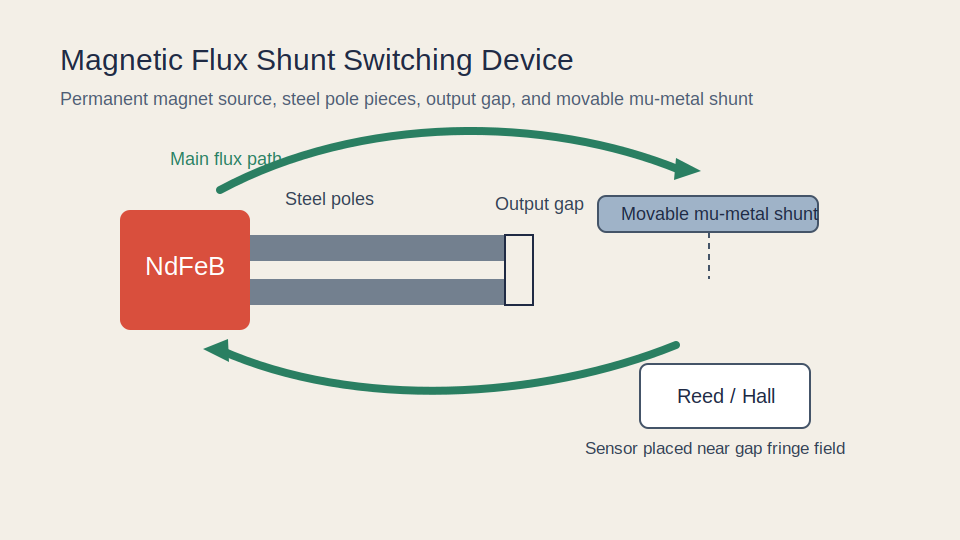
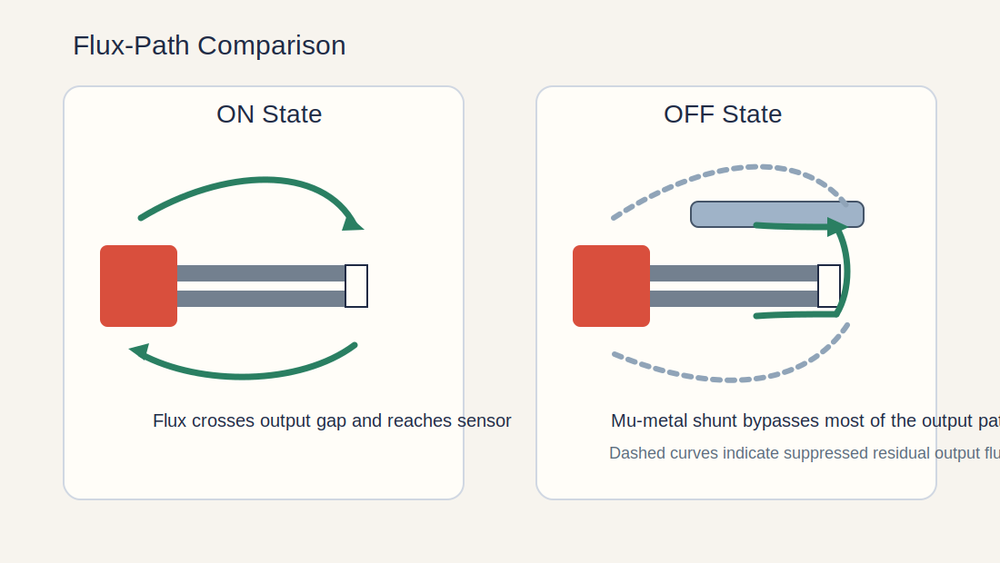
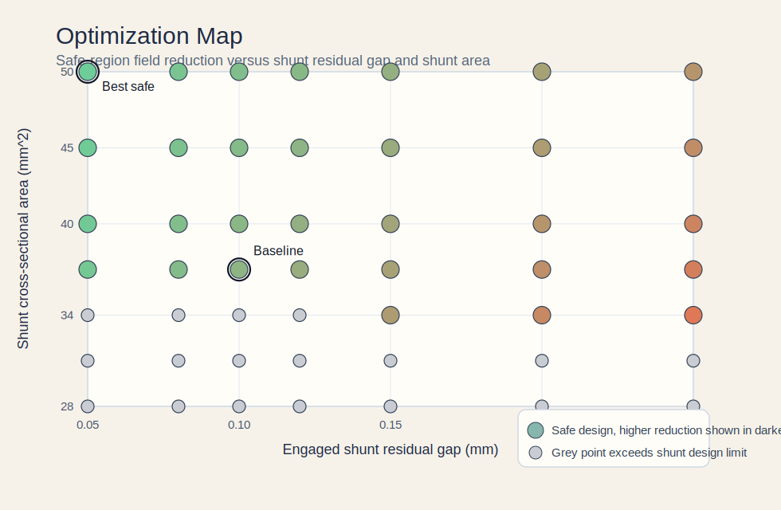

# Mu-Metal Magnetic Circuit Design for Switching

Portfolio case study presented as relevant prior work for mu-metal switching applications.

## Past Work Summary

This project is framed as a completed concept-design engagement for a compact magnetic switching mechanism using mu-metal. The work focused on selecting the magnetic architecture, quantifying switching behavior, checking reliability margins, and preparing a prototype-oriented recommendation package.

The selected concept uses a movable high-permeability mu-metal shunt to redirect flux between an output gap and a bypass path. That lets the device toggle between a strong-field switching state and a suppressed-field state without changing the permanent magnet itself.



The concept is intended for:

- low-power magnetic switching functions
- reed switch or Hall sensor actuation
- instrumentation interlocks
- compact magnetic gating and latching mechanisms



## Project Brief

The design work was carried out against the following project targets:

- output state must provide enough field at the sensing region to trip a reed switch
- shunted state must reduce the field by at least 80 percent
- geometry must remain compact enough for bench-top prototyping
- the shunt should operate below a conservative mu-metal saturation threshold
- design should be manufacturable from standard machined or laser-cut parts
- switching behavior should remain robust under realistic mechanical tolerance variation
- the design should be documented in a way that supports prototyping and review

## Work Performed

The scope covered:

- magnetic architecture selection
- mu-metal usage justification
- reluctance-based switching analysis
- saturation and tolerance review
- parameter sweep for geometry optimization
- prototype-oriented design recommendations

## Implemented Concept

The circuit uses five functional elements:

1. `NdFeB permanent magnet`
2. `soft steel pole pieces`
3. `controlled output air gap`
4. `movable mu-metal shunt`
5. `reed switch or Hall sensor near the output gap`

In the `ON` state, the shunt is retracted, so flux crosses the output gap and creates a usable field at the sensor or switching region.

In the `OFF` state, the mu-metal shunt bridges the pole pieces and offers a much lower reluctance path than the output gap. Most of the flux is diverted through the shunt, sharply reducing the field at the sensing region.

## Delivered Result

Using the baseline geometry documented in [docs/design-notes.md](/home/fadali/magnetic-flux-shunt-switch/docs/design-notes.md):

- estimated output-gap flux density, `ON`: about `0.85 T`
- estimated output-gap flux density, `OFF`: about `0.05 T`
- estimated field reduction at the output gap: about `94 percent`
- estimated shunt flux density in the diverted state: about `0.71 T`

That shunt flux density remains below a conservative mu-metal design ceiling of roughly `0.75 T`, which kept the proposed switching concept inside a credible operating region for prototype planning.

## Why This Is Relevant Past Work

This case study is relevant to clients asking for mu-metal magnetic circuit design for switching because it demonstrates:

- `mu-metal based switching circuit`
  The switching element is explicitly a mu-metal shunt, not a generic core.
- `engineering design focus`
  The repository includes requirements, calculations, tradeoff analysis, and generated design outputs.
- `optimal performance`
  The design is evaluated on ON-state field, OFF-state suppression, and sensitivity to shunt geometry.
- `reliability`
  The notes address saturation margin, residual air gap control, forming sensitivity, repeatability, and fabrication constraints.
- `deliverable quality`
  The work is packaged as a concise technical deliverable rather than only a rough concept note.

## Optimization And Scaling

To move beyond a single-point estimate, the repository now includes a parametric sweep across:

- engaged shunt residual gap from `0.05 mm` to `0.25 mm`
- shunt cross-sectional area from `28 mm^2` to `50 mm^2`

The generated study is documented in [docs/optimization-study.md](/home/fadali/magnetic-flux-shunt-switch/docs/optimization-study.md).

Key outcome:

- best safe sweep point: `0.05 mm` gap, `50 mm^2` shunt area
- modeled OFF-state output field at that point: about `0.018 T`
- modeled field reduction at that point: about `97.8 percent`
- baseline remains a balanced choice because `0.10 mm` is a more realistic mechanical tolerance target than `0.05 mm` for a first prototype
- the sweep shows what performance was available if the design moved toward a tighter mechanical tolerance target



## Repository Contents

- [docs/design-notes.md](/home/fadali/magnetic-flux-shunt-switch/docs/design-notes.md): full problem definition, assumptions, and magnetic calculations
- [docs/optimization-study.md](/home/fadali/magnetic-flux-shunt-switch/docs/optimization-study.md): parameter sweep and design tradeoff summary
- [docs/past-work-summary.md](/home/fadali/magnetic-flux-shunt-switch/docs/past-work-summary.md): scope, constraints, deliverables, and outcomes framed as prior work
- [scripts/reluctance_calculator.py](/home/fadali/magnetic-flux-shunt-switch/scripts/reluctance_calculator.py): simple reluctance-network calculator for the baseline design
- [scripts/optimization_sweep.py](/home/fadali/magnetic-flux-shunt-switch/scripts/optimization_sweep.py): generates the optimization study and SVG design map
- [assets/device-overview.svg](/home/fadali/magnetic-flux-shunt-switch/assets/device-overview.svg): visual overview of the switching concept
- [assets/flux-paths.svg](/home/fadali/magnetic-flux-shunt-switch/assets/flux-paths.svg): ON and OFF flux-path comparison
- [assets/optimization-map.svg](/home/fadali/magnetic-flux-shunt-switch/assets/optimization-map.svg): safe-region design map for gap and shunt area

## Design Inputs

Baseline assumptions used in this study:

- magnet material: `NdFeB`
- magnet cross-section: `5 mm x 5 mm`
- magnet length along magnetization axis: `5 mm`
- magnet coercive field used for first-pass model: `850 kA/m`
- output gap length: `1.5 mm`
- output gap cross-section: `25 mm^2`
- shunt effective gap when engaged: `0.1 mm`
- shunt body length: `20 mm`
- shunt cross-section: `37 mm^2`
- mu-metal relative permeability for first-pass estimate: `50,000`

## Why Mu-Metal Here

Mu-metal is not treated as a universal core material in this design. It is used specifically where its very high permeability is valuable: as a low-reluctance flux shunt that can strongly divert magnetic flux when engaged.

That choice is defensible because:

- the shunt works in a moderate flux-density regime
- low reluctance matters more than high saturation margin in this part
- the switching function benefits from a dramatic path-preference change

For the pole pieces and return path, soft magnetic steel remains the more practical choice.

## Reliability And Engineering Risk

For a switching application, performance alone is not enough. The design also needs to remain reliable and repeatable. The main controlled risks in this concept are:

- `residual shunt gap variation`
  This is the main driver of OFF-state performance drift.
- `mu-metal property degradation after forming`
  Annealing and manufacturing route matter if high permeability must be preserved.
- `local saturation risk in the shunt`
  The design keeps the baseline around `0.71 T`, below the project design ceiling.
- `fixture repeatability`
  Mechanical stops or calibrated spacers are recommended if consistent switching thresholds are required.
- `sensor placement sensitivity`
  The field in the actual switch region depends on fringe-field geometry, not only center-gap flux density.

## What This Shows A Client

This case study is built to demonstrate the kind of value a client hiring for this brief would care about:

- translating a short scope into a workable magnetic architecture
- selecting mu-metal for the part of the circuit where it is actually useful
- quantifying switching performance instead of describing it vaguely
- checking reliability limits such as saturation and geometric tolerance sensitivity
- presenting results in a format that can support design review or prototype planning

## How To Run The Calculator

From the repository root:

```bash
python3 scripts/reluctance_calculator.py
python3 scripts/optimization_sweep.py
```

The baseline calculator prints the modeled reluctances, estimated flux split, gap flux density in each state, and a simple saturation check for the mu-metal shunt.

The optimization script regenerates the study markdown and SVG map from the same reluctance model.

## Next Expansion Options

This repository is intentionally scoped as a strong first portfolio artifact. Natural follow-up work would be:

- FEMM or COMSOL field simulation snapshots
- a 2D fringe-field estimate at the real sensor location
- CAD renders and fabrication drawings
- prototype test data against a reed switch pickup threshold

## Portfolio Positioning

The strongest use of this repo is as prior work when saying:

`I have already worked through a mu-metal switching circuit with performance analysis, optimization, and prototype-oriented reliability review.`

## Author

Prepared by `Mohamed Fadel` as an engineering portfolio project focused on magnetic switching design.
